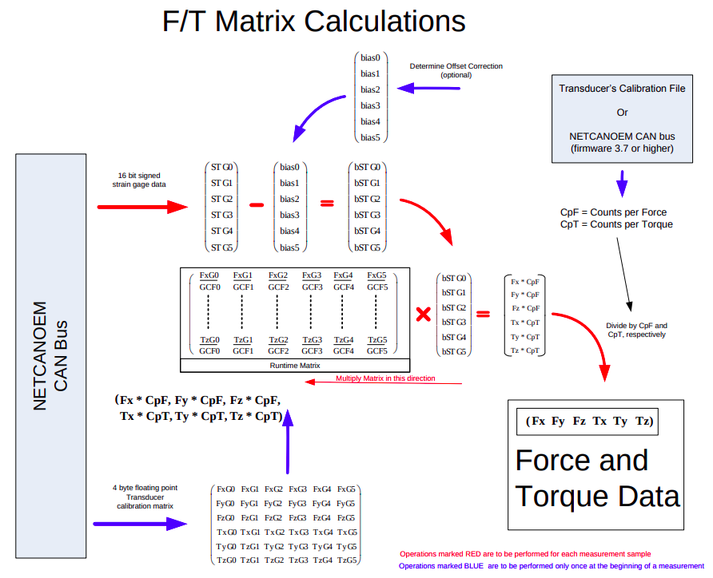

# Sensor info JSON

``` json
{
    "Type": "sensor_info",
    "Serial": "serial_number",
    "Fimware_version":{
        "major": "3",
        "minor": "8",
        "build": "2",
    },
    "Counts_per":{
        "force": 1000000,
        "torque": 1000000,
    },
    "Unit":{
        "force": "N",
        "torque": "N_m",
    },
    "Last_message": "True"
}
```

#Matrix JSON
``` json
{
    "Type": "matrix",
    "Fx":["number_fxsg0", "number_fxsg1", "number_fxsg2", "number_fxsg3", "number_fxsg4", "number_fxsg5"],
    "Fy":["number_fysg0", "number_fysg1", "number_fysg2", "number_fysg3", "number_fysg4", "number_fysg5"],
    "Fz":["number_fzsg0", "number_fzsg1", "number_fzsg2", "number_fzsg3", "number_fzsg4", "number_fzsg5"],
    "Tx":["number_txsg0", "number_txsg1", "number_txsg2", "number_txsg3", "number_txsg4", "number_txsg5"],
    "Ty":["number_tysg0", "number_tysg1", "number_tysg2", "number_tysg3", "number_tysg4", "number_tysg5"],
    "Tz":["number_tzsg0", "number_tzsg1", "number_tzsg2", "number_tzsg3", "number_tzsg4", "number_tzsg5"],
    "Last_message": "True"
}
```

#Force, Torque and Status JSON
``` json
{
    "Type": "status_force_torque",
    "Status":[
        "0",    # bit 0
        "0",    # bit 1
        "0",    # bit 2
        "0",    # bit 3
        "0",    # bit 4
        "0",    # bit 5
        "0",    # bit 6
        "0",    # bit 7
        "0",    # bit 8
        "0",    # bit 11 (bit 9 and bit 10 no!)
        "0",    # bit 12 
        "0",    # bit 14 (bit 13 no!)
        "0"     # bit 15
    ],
    
    "FT":[ "fx", "fy, "fz", "tx", "ty", "tz"],
    
    "Last_message": "True"
}
```

#SG Data and Status JSON
``` json
{
    "Type": "status_SG",
    "Status":[
        "0",    # bit 0
        "0",    # bit 1
        "0",    # bit 2
        "0",    # bit 3
        "0",    # bit 4
        "0",    # bit 5
        "0",    # bit 6
        "0",    # bit 7
        "0",    # bit 8
        "0",    # bit 11 (bit 9 and bit 10 no!)
        "0",    # bit 12 
        "0",    # bit 14 (bit 13 no!)
        "0"     # bit 15
    ],
    
    "SG":[ "sg0", "sg1", "sg2", "sg3", "sg4", "sg5"],
                         
    "Last_message": "True"
}
```
